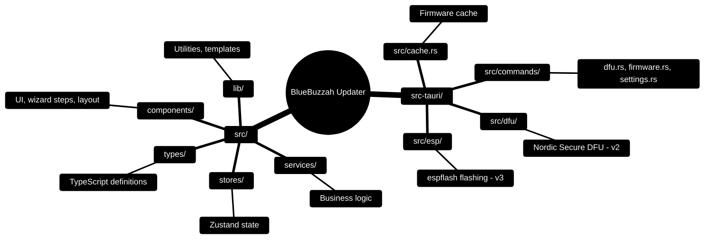

# BlueBuzzah Updater

[](https://github.com/BlueBuzzah/BlueBuzzah-Updater/releases/latest)
[](https://github.com/BlueBuzzah/BlueBuzzah-Updater/releases/latest)
[](https://github.com/BlueBuzzah/BlueBuzzah-Updater/actions/workflows/test.yml)
[](https://app.snyk.io/org/rbonestell/project/8b6e37e4-60b5-4772-a925-9dff00d8dce2)
[](LICENSE)

Device firmware updater for BlueBuzzah devices. Supports both hardware revisions from a single app:

| Hardware | Board | Flash protocol |
| -------- | ----- | -------------- |
| BlueBuzzah v2 | Adafruit Feather nRF52840 Express | Nordic Secure DFU over serial |
| BlueBuzzah v3 (PentaBuzzer) | Seeed XIAO ESP32-S3 | esptool protocol via espflash |

The correct firmware package and flash protocol are selected automatically based on the detected hardware.

## 🚀 Quick Start

### For Users

Download the appropriate package for your operating system and install:

[![Download for Windows][1]][2] [![Download for macOS][3]][4]

> [!NOTE]  
> Windows releases are not currently code-signed. You may see security warnings on first run:
>
> - **Windows**: Click "More info" → "Run anyway"
>
> Windows code signing to be added in future releases.

### For Developers

```bash
# Clone and install
git clone https://github.com/BlueBuzzah/BlueBuzzah-Updater.git
cd BlueBuzzah-Updater
npm install

# Run development server
npm run tauri:dev

# Build for production
npm run tauri:build
```

> [!NOTE]  
> **Need detailed setup instructions?** See [SETUP.md](SETUP.md) for complete installation guide, prerequisites, and troubleshooting.

## ✨ Features

- **Modern UI**: Beautiful dark-themed interface with BlueBuzzah brand colors (#35B6F2, #05212D)
- **4-Step Wizard**: Intuitive workflow from firmware selection to successful installation
- **GitHub Integration**: Automatically fetches latest firmware releases, with the right package per hardware revision
- **Multi-Hardware Support**: Flashes both v2 (nRF52840) and v3 (ESP32-S3) devices with the matching protocol
- **Auto-Detection**: Automatically detects connected devices over serial and identifies their hardware revision
- **Dual-Device Support**: Update up to 2 devices of the same hardware revision simultaneously with PRIMARY/SECONDARY roles
- **Firmware Cache**: Downloaded firmware is cached per version and board with SHA256 verification
- **Real-time Progress**: Live progress tracking with detailed logging
- **Cross-Platform**: Native support for macOS and Windows

## 🏗️ Architecture

**Frontend:** React 18 + TypeScript + Zustand + shadcn/ui + Tailwind CSS
**Backend:** Tauri 2.0 + Rust for device detection, firmware flashing (Nordic Secure DFU and espflash), and post-flash role configuration over serial

### Project Structure



### Wizard Flow

1. **Firmware Selection** → Browse GitHub releases and select version
2. **Device Selection** → Auto-detect devices (v2/v3) and assign roles (PRIMARY/SECONDARY)
3. **Installation** → Flash firmware with real-time progress, then configure device role over serial
4. **Complete** → Success screen with post-installation instructions

## 🎨 UI/UX

The application features a modern dark theme with BlueBuzzah brand colors:

- **Primary Blue** (#35B6F2) - Highlights, buttons, progress indicators
- **Dark Navy** (#05212D) - Cards, secondary surfaces
- **Smooth animations** and **glow effects** for a polished user experience

For complete design system documentation, see [docs/DESIGN_GUIDE.md](docs/DESIGN_GUIDE.md).

## 📦 Technology Stack

| Category             | Technologies                         |
| -------------------- | ------------------------------------ |
| **Frontend**         | React 18, TypeScript, Vite           |
| **UI Components**    | shadcn/ui (dark theme), Tailwind CSS |
| **State Management** | Zustand                              |
| **Icons**            | Lucide React                         |
| **Backend**          | Tauri 2.0, Rust                      |
| **Flashing**         | Nordic Secure DFU (native Rust, v2), espflash (v3) |
| **Device Detection** | serialport (VID/PID identification)  |
| **HTTP Client**      | reqwest, native fetch                |

## 📚 Documentation

- **[SETUP.md](SETUP.md)** - Complete setup guide, prerequisites, and troubleshooting
- **[docs/DESIGN_GUIDE.md](docs/DESIGN_GUIDE.md)** - Complete design system, UI/UX patterns, and component guidelines
- **[docs/TAURI_DFU_FLASH_GUIDE.MD](docs/TAURI_DFU_FLASH_GUIDE.MD)** - DFU flashing implementation guide

## 🔧 Development

### Key Commands

```bash
npm run tauri:dev      # Development mode with hot reload
npm run tauri:build    # Production build (DMG for macOS, MSI for Windows)
npm run dev            # Frontend only (no Tauri)
npm test               # Frontend tests (Vitest)
npm run tauri:test     # Rust tests
```

### Device Configuration

After flashing, the updater configures each device's role over serial (`SET_ROLE:PRIMARY` / `SET_ROLE:SECONDARY`):

- **PRIMARY**: Coordinator device, broadcasts to secondary
- **SECONDARY**: Listener device, receives from primary

## 🤝 Contributing

Contributions are welcome! Please:

1. Fork the repository
2. Create a feature branch
3. Follow existing code style and architecture
4. Submit a pull request with clear description

## 📄 License

MIT License - see [LICENSE](LICENSE) file for details.

Copyright (c) 2025 BlueBuzzah Partners

[1]: assets/download-windows.png
[2]: https://github.com/BlueBuzzah/BlueBuzzah-Updater/releases/latest/download/BlueBuzzah_Updater_x64_en-US.exe "Download for Windows"
[3]: assets/download-macos.png
[4]: https://github.com/BlueBuzzah/BlueBuzzah-Updater/releases/latest/download/BlueBuzzah_Updater_universal.dmg "Download for macOS"
